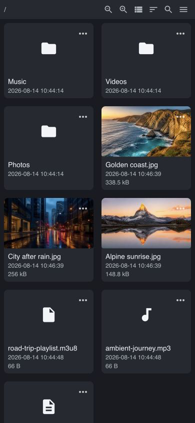
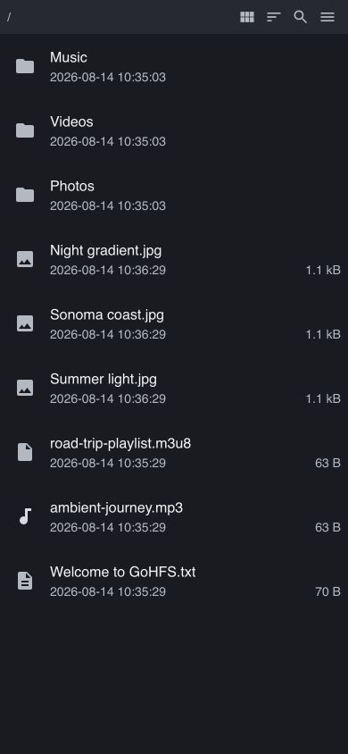

<div align="center">
  <h1>GoHFS</h1>
  <p>A small cross-platform desktop file server with a modern web interface.</p>
</div>

GoHFS turns a local directory into a browser-accessible file library. It ships the
React interface inside a single Go binary, can stay in the system tray on macOS and
Windows, and keeps its configuration and UI preferences in a local profile.

## Screenshots

<table>
  <tr>
    <th>Mobile grid view</th>
    <th>Mobile list view</th>
  </tr>
  <tr>
    <td></td>
    <td></td>
  </tr>
</table>

> [!WARNING]
> GoHFS does not provide authentication or TLS. Do not expose it directly to the
> public internet or to a network you do not trust. Bind it to `127.0.0.1` for
> local-only use, or put it behind an authenticating HTTPS reverse proxy.

## Features

- Browse, sort, search, and download files from desktop or mobile browsers.
- Switch between list and thumbnail grid views.
- Play audio, video, and HLS streams with subtitle and audio-track controls.
- Generate image and video previews with `ffmpeg`.
- Upload large files in chunks, including drag-and-drop uploads.
- Optionally create, rename, and remove files in explicitly writable locations.
- Mount additional files or directories at virtual paths.
- Add custom open handlers and actions by file extension.
- Generate an M3U8 playlist and QR codes for available server addresses.
- Inspect directory size and filesystem usage.
- Configure and reload the server from the tray on macOS and Windows.

## Requirements

- [Go 1.25 or newer](https://go.dev/dl/)
- [Node.js 24](https://nodejs.org/) and npm (the version is pinned in `.nvmrc`)
- Optional: [ffmpeg](https://ffmpeg.org/) on `PATH` for thumbnails and previews

## Build and run

Clone the repository and install the UI dependencies:

```sh
git clone https://github.com/Feverqwe/goHFS.git
cd goHFS
nvm use
npm ci --prefix ui
```

Build the production UI and embed it into the Go executable:

```sh
./scripts/build.sh
./goHFS
```

On the first launch, GoHFS creates `config.yaml` in its profile directory. The
default port is `80`; if that port is unavailable or requires elevated privileges,
stop the app, change `port` to `8080` (or another free port), and start it again.
Then open `http://127.0.0.1:8080` in a browser.

To run without the tray icon on macOS or Windows:

```sh
./goHFS -disableTrayIcon
```

### Platform packages

macOS application bundle:

```sh
./scripts/build.mac.sh
```

Windows GUI executable (run from Command Prompt):

```bat
cd scripts
build.win.bat
```

Linux uses the regular `./scripts/build.sh` output and runs without a tray icon.

## Configuration

The active configuration is `config.yaml` in the profile directory:

| Platform | Default profile directory |
| --- | --- |
| macOS | `~/Library/Application Support/com.rndnm.gohfs` |
| Windows | The application's working directory |
| Linux | The directory containing the executable |

Set `PROFILE_PLACE` to keep the profile elsewhere:

```sh
PROFILE_PLACE=/path/to/gohfs-profile ./goHFS
```

A small local-only configuration looks like this:

```yaml
port: 8080
address: 127.0.0.1
public: /path/to/files
name: My files

# Paths are virtual URL paths, not operating-system paths.
writablePatterns:
  - /uploads/**

# Mount another local directory below the public root.
links:
  - place: /archive
    target: /path/to/archive
    cacheTTL: 60

ffmpegPath: ffmpeg
previewWorkers: 2
previewTtl: 604800
```

Set `address: 0.0.0.0` to listen on all interfaces and make the server reachable
from the local network. Leave `writablePatterns` empty for a read-only server. To
make the entire virtual tree writable, use `/**`; exclusion rules start with `!`
and must appear before broader allow rules.

GoHFS understands these configuration keys:

| Key | Purpose |
| --- | --- |
| `port`, `address` | HTTP listen port and interface |
| `public`, `name` | Root directory and browser title |
| `writablePatterns` | Ordered allow/exclude patterns for modifying files |
| `links` | Extra files or directories mounted at virtual paths |
| `extHandle` | URL opened by default for a file extension |
| `extActions` | Additional named actions for a file extension |
| `ffmpegPath` | Path to the `ffmpeg` executable |
| `previewWorkers` | Number of parallel preview jobs |
| `previewVideoExts`, `previewImageExts` | Extensions eligible for previews |
| `previewTtl` | Preview cache lifetime in seconds |

For example, the bundled media player can be assigned to more video formats:

```yaml
extHandle:
  .mp4: /~/www/player.html?url={url}
  .mkv: /~/www/player.html?url={url}
  .webm: /~/www/player.html?url={url}
```

After editing the file, choose **Reload config** in the web menu or tray menu. A
legacy `config.json` is migrated automatically when no YAML configuration exists.
UI preferences are stored in `storage.db`, while generated previews live in the
`previews` directory beside the configuration.

## Development

Build and run against files in `ui/dist`:

```sh
./scripts/run.sh dev
```

Useful checks before submitting changes:

```sh
go test ./...
go vet ./...

cd ui
npm run tsc
npm run lint
npm run build
npm run build-storybook
```

The backend entry point is `main.go`; HTTP, configuration, storage, and preview
code lives under `internal/`. The React/TypeScript application is in `ui/src`, and
`assets/embed.go` packages the production UI into the final executable.
